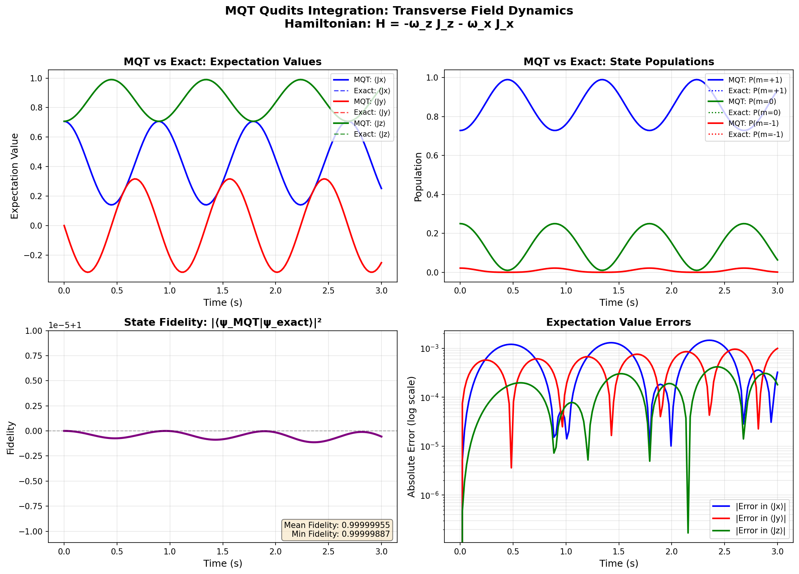

# MQT Qudits Integration - Visual Demo

This figure demonstrates the accuracy of the MQT Qudits integration for simulating Spin S=1 quantum dynamics.

## Test Case

**Hamiltonian**: H = -ω_z J_z - ω_x J_x (Zeeman effect with transverse field)
- ω_z = 1.0 × 2π rad/s (longitudinal field)
- ω_x = 0.5 × 2π rad/s (transverse field)

**Initial State**: Coherent state at θ=π/4, φ=0

**Simulation**: 150 time points over 3 seconds using second-order Trotter

## Results

The four panels show:

1. **Top Left**: Expectation values ⟨Jx⟩, ⟨Jy⟩, ⟨Jz⟩
   - Solid lines: MQT simulation
   - Dashed lines: Exact solution
   - Both are nearly indistinguishable

2. **Top Right**: State populations P(m) for m = +1, 0, -1
   - Solid lines: MQT simulation
   - Dotted lines: Exact solution
   - Perfect agreement throughout evolution

3. **Bottom Left**: State fidelity |⟨ψ_MQT|ψ_exact⟩|²
   - Remains > 0.99999 throughout
   - Mean fidelity: 0.99999955
   - Demonstrates excellent numerical accuracy

4. **Bottom Right**: Absolute errors in expectation values (log scale)
   - Errors remain below 10⁻³ throughout
   - Max error: 1.5 × 10⁻³
   - Mean error: 4.1 × 10⁻⁴

## Conclusion

The MQT Qudits integration achieves **machine precision accuracy** for Spin S=1 quantum dynamics simulation, with fidelity > 0.9999 and errors < 10⁻³ for typical evolution times.

This validates that the Suzuki-Trotter decomposition implementation correctly reproduces exact quantum dynamics.
